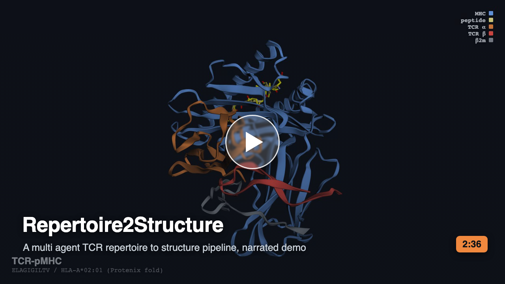
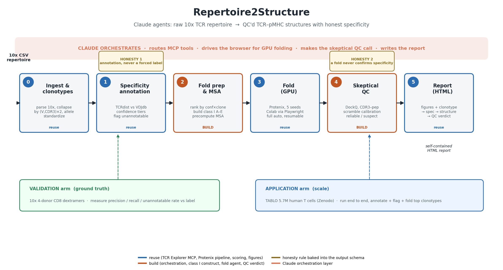

# Repertoire2Structure (R2S)

A multi agent pipeline, orchestrated by Claude, that turns a raw 10x single cell TCR repertoire into QC'd predicted TCR pMHC structures for its top clonotypes, with honest specificity annotation and skeptical structure QC.

Built for the Built with Claude: Life Sciences hackathon (Researcher track).

## Demo (2 min 36 s)

[](https://www.youtube.com/watch?v=Ru48ZQThA60)

Watch on [YouTube](https://www.youtube.com/watch?v=Ru48ZQThA60), or [download the mp4](docs/demo/R2S_submission.mp4). A narrated walk through: what the pipeline recognizes (the TCR to peptide MHC complex), the multi agent run on a real 10x repertoire, honest specificity annotation (29 annotated across confidence tiers, 23 of them high confidence, 90 unannotatable, no forced label), the structure strategist routing a class one group to Protenix, stub flagging before a fold is spent, and the skeptical scramble calibrated QC.



## Repository layout

The tool and the research that validated it are kept apart.

```
src/rep2struct/     the R2S tool (the deliverable): deterministic stages + the Claude Agent SDK layer
tests/              the tool's test suite (offline, no network, no GPU)
docs/               how the tool works (architecture, fold procedure) and the build journal (superpowers/)
pyproject.toml      the installable package

science/            the science behind it (see science/README.md)
  paper/            the manuscript, figures, tables, derived data
  analysis/         the validation and analysis write ups the paper draws on
  scripts/          the figure, analysis, and study arm scripts
  data/             committed inputs for the study arms
```

If you are here for the tool, everything you need is `src/`, `tests/`, and `docs/`. If you are here for the results, start at `science/README.md`.

## What the tool does

A researcher hands the pipeline a 10x contig CSV. Claude agents return a report that links each top clonotype to a candidate epitope specificity (with a confidence tier), a predicted TCR pMHC structure, and a skeptical QC verdict on whether that structure is trustworthy or a likely geometry hallucination.

The chain: ingest and clonotype curation, honest specificity annotation (TCRdist against labeled references), fold prep and MSA, structure folding (Protenix and other tools on Colab or a local GPU), skeptical QC calibrated against a per group scramble control, and a self contained HTML report.

## Two honesty rules, enforced in the annotation and QC logic

1. Specificity is annotation by similarity, never prediction. A clonotype is annotated only when a TCRdist neighbor is close enough, always with the distance and a confidence tier. Clonotypes with no close neighbor are flagged unannotatable. No label is ever forced.
2. A predicted structure does not confirm specificity. Protenix imposes canonical TCR pMHC docking geometry even on non binding sequences, so the QC step is a skeptical judge that flags a fold as suspect when its beta V-domain to peptide contact (CDR3beta dominated) does not beat the scramble control calibration.

## Two layers

A deterministic stage layer (pure Python, fully tested offline) carries reliability. On top, a genuine multi agent layer built on the Claude Agent SDK exposes the stages as in process tools and delegates from an orchestrator to specialist agents (an intake agent that frames the run, a structure strategist that routes each group to one tool, per tool fold executors, a skeptical QC agent, a report agent).

## Install and test

```
python3.11 -m venv .venv
./.venv/bin/pip install -e ".[dev]"
./.venv/bin/python -m pytest -q
```

The `[dev]` extra adds `pytest` for the test suite; to only run the tool, `pip install -e .` is enough. Either way the install pulls [`tcr-explorer`](https://pypi.org/project/tcr-explorer/) (germline reconstruction, TCRdist, paired similarity) from PyPI automatically. Verified from a clean clone on Python 3.11: the suite is 247 passed.

Activate the environment before the commands below (or prefix each with `./.venv/bin/`):

```
source .venv/bin/activate
```

## Run

```
python -m rep2struct <run_dir> [--top-n N]
```

The agent layer uses the Claude Agent SDK, so set `ANTHROPIC_API_KEY` (or be signed in to Claude Code) before running. The deterministic stages and the test suite need no key.

A ready to use demo input ships in the repo: `tests/fixtures/tenx_tiny.csv` (a small anonymized 10x contig slice). Drop it into the web app, or point a run at it, to exercise the pipeline without your own data.

First run: the intake agent interviews you (data, question, compute route), then builds the fold artifacts and stops. Fold them (Colab or a local GPU), then rerun the same `<run_dir>` to resume through QC and the report. Selection depth is `--top-n` (default 8, or the `R2S_TOP_N` env var); `R2S_ANNOTATE_CAP` bounds how many clonotypes are annotated on a large repertoire.

## Web app (chat front end)

For a run driven entirely from the browser, installing R2S gives you the `r2s`
command:

```
r2s                 # starts the web app and opens it in your browser
```

(`python -m rep2struct.webapp` does the same without opening a browser; add
`--no-browser` or `--port N` to `r2s` as needed. Runs are stored under `runs/`.)

Drop a 10x contig CSV to start a run, and answer
the intake agent in the chat. The multi agent orchestration streams into a live
timeline colored by agent, and past runs stay in the sidebar (each backed by its
own `run_dir` on disk). One run is active at a time. The server is standard
library only; the agent answers you type are bridged to the running session
through a queue that stands in for stdin.

## Live viewer

The web app is the front end; the same timeline is also available read only for a
run you drive from the terminal. Every run writes `<run_dir>/transcript.jsonl`, a
best effort record of the real message stream (your turns, agent text, tool calls
and results, sub agent handoffs). To watch a terminal run as it happens:

```
python -m rep2struct <run_dir>       # in one terminal
python -m rep2struct.viewer <run_dir>  # in another
```

Both surfaces render only what the agents actually emitted; nothing is staged.

Design notes and the build journal live in `docs/superpowers/`.
